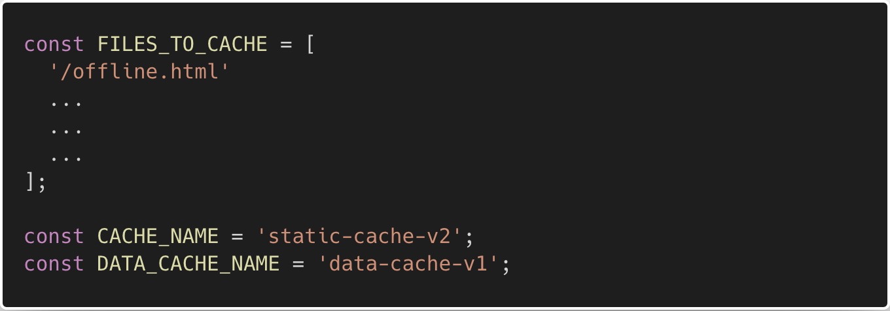
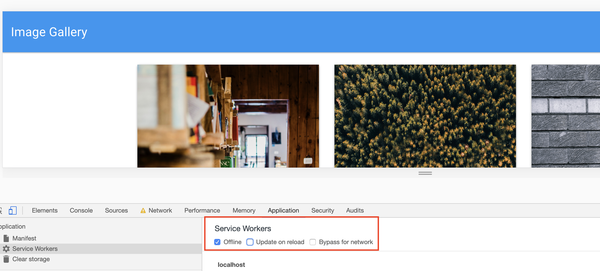

# Budget-Tracker

## Table of Contents

1. [Overview](#overview)
2. [Site Links](#site-links)
3. [Instruction](#instruction)
4. [Technologies Used](#technologies-used)
5. [License](#license)
6. [Let's Connect!](#connect)

</br>
<p align="center">
    
    
    
    
    
    
    
      
      
      
</p>

<a name="overview"></a>

## 1. Overview

```
AS AN avid traveller
I WANT to be able to track my withdrawals and deposits with or without a data/internet connection
SO THAT my account balance is accurate when I am traveling
```

<a name="site-links"></a>

## 2. Site Links

- [github repository site] https://github.com/TakuyaMats/Budget-Tracker.git

- [live site] https://peaceful-ravine-09744.herokuapp.com/

<a name="instruction"></a>

## 3. Instructions

- Open a terminal and start `mongod` if it isn't already running.

- Open another terminal and run the commands:

  - `npm install`

  - `npm start`

- Add the following code to your `service-worker.js` file.

- Copy/Type out the following code snippets when adding them to your application, it will help you solidify what you are doing!

- As you go through each step, keep your Chrome Develop tools open to monitor your progress and debug if needed.

  ### 1. Uncomment the code to set up cache files in `service-worker.js`.

  

  ### 2. Add code to install and register your service worker.

  ```js
  // Install

  self.addEventListener("install", function (evt) {
    // pre cache image data
    evt.waitUntil(
      caches.open(DATA_CACHE_NAME).then((cache) => cache.add("/api/images"))
    );

    // pre cache all static assets
    evt.waitUntil(
      caches.open(CACHE_NAME).then((cache) => cache.addAll(FILES_TO_CACHE))
    );

    // tell the browser to activate this service worker immediately once it
    // has finished installing
    self.skipWaiting();
  });
  ```

  ### 3. If done successfully, you should see your static cache in your Application tab.

  

  ### 4. Add code to activate the service worker and remove old data from the cache.

  ```js
  self.addEventListener("activate", function (evt) {
    evt.waitUntil(
      caches.keys().then((keyList) => {
        return Promise.all(
          keyList.map((key) => {
            if (key !== CACHE_NAME && key !== DATA_CACHE_NAME) {
              console.log("Removing old cache data", key);
              return caches.delete(key);
            }
          })
        );
      })
    );

    self.clients.claim();
  });
  ```

  ### 5. Enable the service worker to intercept network requests.

  ```js
  self.addEventListener("fetch", function (evt) {
    // code to handle requests goes here
  });
  ```

  ### 6. Serve static files from the cache. Proceed with a network request when the resource is not in the cache. This code allows the page to be accessible offline. (This code should be placed in the function handling the `fetch` event.)

  ```js
  evt.respondWith(
    caches.open(CACHE_NAME).then((cache) => {
      return cache.match(evt.request).then((response) => {
        return response || fetch(evt.request);
      });
    })
  );
  ```

  ### 7. Type the remaining code to cache responses for requests for data. The function handling the `fetch` event should resemble the following:

  

  ## If done successfully you will see your data cache in your Application tab. At this point you should be able to put your application in offline mode for an offline experience.

  

  

<a name="technologies-used"></a>

## 4. Technologies Used

<p align="center">
    <a href="https://developer.mozilla.org/en-US/docs/Web/HTML"></a>
    <a href="https://developer.mozilla.org/en-US/docs/Web/CSS"></a>
    <a href="https://www.javascript.com/"></a>
    <a href="https://getbootstrap.com/"></a>
    <a href="https://nodejs.org/en/"></a>
    <a href="https://www.npmjs.com/package/express"></a>
    <a href="https://www.mongodb.com/"></a>
</p>

<a name="license"></a>

## 5. License

[](https://github.com/git/git-scm.com/blob/main/MIT-LICENSE.txt)

<a name="connect"></a>

## 6. Let's Connect!

[](https://github.com/TakuyaMats)
[](https://www.linkedin.com/in/takuyamatsumoto90/)
